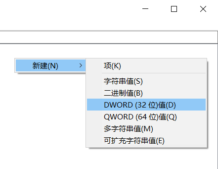
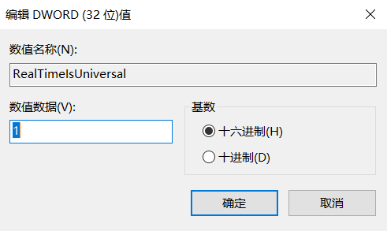

# Ubuntu_Windows_Adjust_Time
Guide about correcting the BIOS Clock Time interpret diffreence between Ubuntu and Windows10

#### 1.Use `"Win+R"` to open execute tab and fill in "*regedit*" 

#### 2.Open it in this *path*

#### 3.Create a *DWORD* item and Edit value

#### 4.Check you have created this item like this picture

